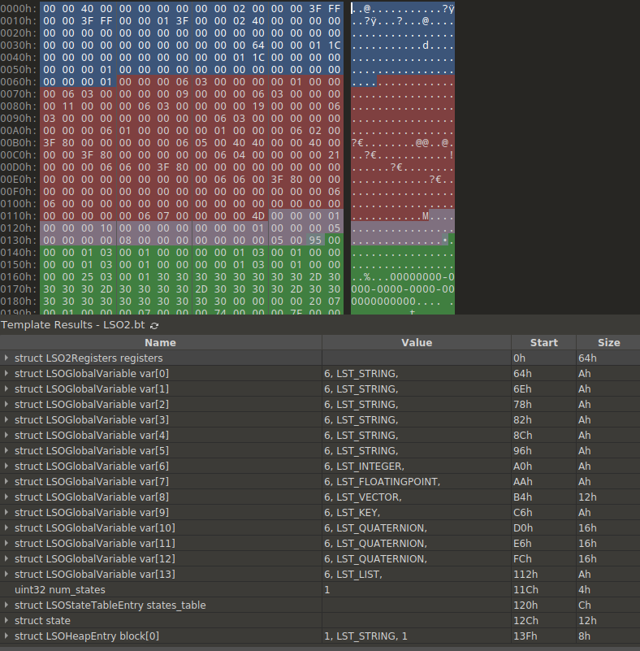

# Extras

## LSO dissector for 010 Editor 12+

Useful for debugging codegen issues, doesn't attempt to make sense of
locals on the stack, but has full dissection of register, functions,
states, opcodes and the heap.

